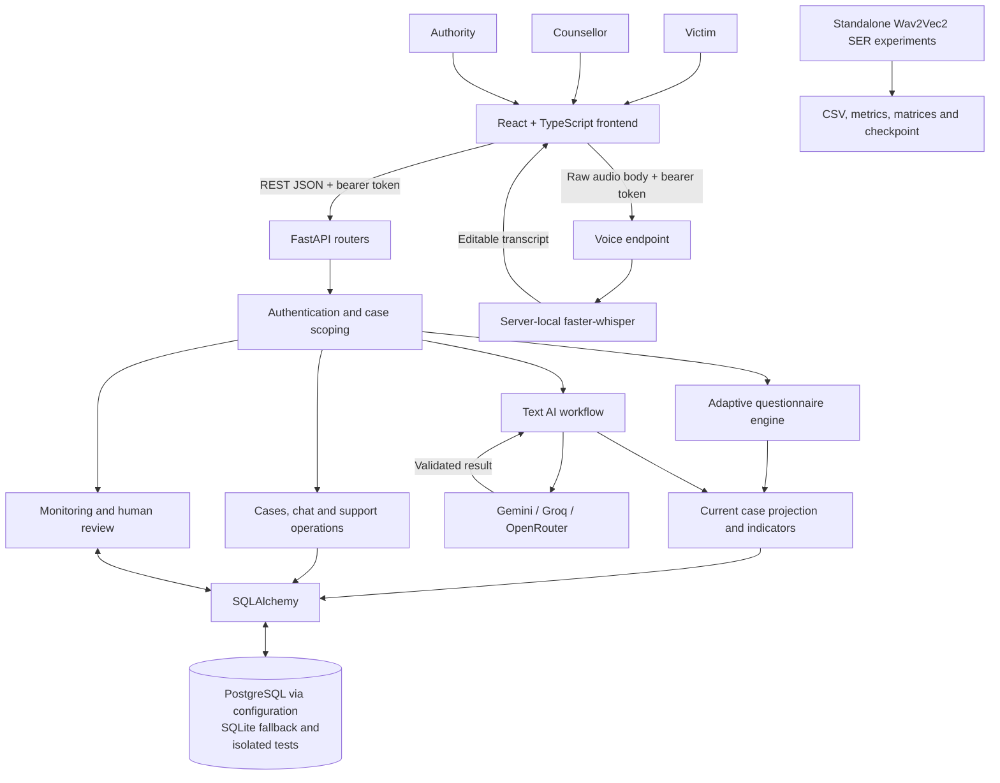
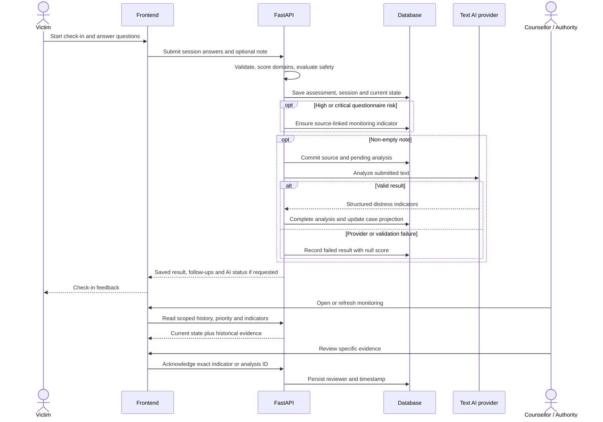
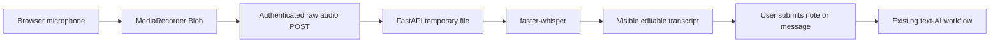

# SAHAS
## AI-Powered Dynamic Mental Health Monitoring and Distress Prediction System for Victims of Atrocities

**Smart India Hackathon 2026 — Final technical prototype report**

**Repository audit date:** 13 September 2026

**Scope:** Current `sih_frontend_latest/`, `sih_backend_latest/`, standalone SER experiments, tests and saved verification artifacts. “Implemented” describes repository functionality, not independently verified production operation.

## EXECUTIVE SUMMARY

Victims of atrocities may need support over an extended period, while the information available to counsellors changes between interactions. A one-time questionnaire captures one observation; it does not provide an ongoing account of changing responses, new concerns or whether earlier signals have received human attention. SAHAS addresses this monitoring problem by connecting repeated victim check-ins with persistent case histories and role-specific professional workflows. It is a decision-support prototype, not a medical diagnostic system or a clinically validated predictor of future harm.

The prototype serves three roles. Victims can complete an adaptive questionnaire, optionally provide text, use a voice-to-text interface, communicate with their assigned counsellor and request human support. Counsellors can inspect assigned cases, compare questionnaire and text-AI observations over time, review priority explanations and acknowledge specific evidence. Authorities can assign cases, inspect aggregate monitoring information and review outstanding indicators and support requests. These workflows use a React and TypeScript frontend, a FastAPI backend and SQLAlchemy persistence, with PostgreSQL support and a SQLite development/test fallback.

The technical approach deliberately separates model inference from deterministic rules. The current questionnaire selects a short set from a 150-question, age-aware bank and calculates a weighted score from answered domains, with separate critical safety overrides. Optional submitted text is analyzed through a configurable Gemini, Groq and OpenRouter provider sequence. Strict validation checks the returned score, risk band, attention flag and explanation before persistence. A source record and pending analysis are committed before the external request, so a provider failure preserves the original interaction and produces an explicit unavailable result rather than a fabricated score. A persisted case projection, historical trend rules and explainable priority calculation connect observations to professional monitoring.

Voice transcription is implemented with server-local faster-whisper and an editable transcript. Repository verification proves mocked voice contracts, but does not establish real local or deployed cloud transcription success. Speech emotion recognition remains a separate experimental track. Saved evaluations report 44.50% accuracy for the Testing 2 pretrained baseline, 30.50% for Testing 3, and 43.75% on Testing 4’s held-out actors after training a classifier head over a frozen Wav2Vec2 encoder. These are emotion-classification results, not distress-prediction accuracy.

SAHAS’s strongest contribution is the integration of evidence capture, failure-aware AI processing, historical persistence, auditable prioritization and human review. This audit reran 90 backend tests and 14 frontend API/voice tests successfully, while also identifying limitations beyond their coverage. Clinical validation, robust conflict handling between signals, production privacy controls, delivered alerts and validated predictive modelling remain future work.

## 1. PROBLEM STATEMENT

The stated SIH problem calls for dynamic mental-health monitoring and distress prediction for victims of atrocities. The engineering challenge is to make changing evidence available to responsible professionals, preserve its history and support timely review without equating automated output with clinical judgement.

| Limitation of a simpler approach | Monitoring requirement addressed by SAHAS |
|---|---|
| One-time questionnaires provide a single observation | Repeatable check-ins and stored assessment history |
| Purely manual monitoring requires staff to inspect each interaction individually | Calculated priority, explanatory reasons and review queues |
| Waiting for a victim to repeatedly identify deterioration puts the reporting burden on that person | Analysis of submitted check-ins and eligible victim messages, plus adaptive follow-ups |
| Isolated sentiment analysis loses source and case context | Case-linked text indicators alongside questionnaire evidence |
| Dashboards without history cannot show changes or distinguish old evidence from current state | Timestamped observations, source labels and historical indicator snapshots |

These are design motivations, not demonstrated health outcomes. SAHAS still requires active participation: it does not passively sense a person's condition, automatically detect unreported events or guarantee continuously staffed assistance. **SAHAS is decision-support and monitoring technology; it is NOT a medical diagnostic system.**

## 2. PROPOSED SOLUTION

| Capability | Current scope | Classification |
|---|---|---|
| Victim interface | Registration, case association, date-of-birth profile, adaptive check-in, optional note, saved check-in status | IMPLEMENTED |
| Counsellor interface | Assigned cases, priority queue, history, explanations, evidence review and human chat | IMPLEMENTED |
| Authority interface | Case assignment, aggregate monitoring, indicator acknowledgement, support operations and scoped CSV export | IMPLEMENTED |
| Dynamic check-ins | Repeatable sessions, age/history-informed question selection and conditional follow-ups | IMPLEMENTED |
| AI-assisted text analysis | Configured provider calls, strict validation, durable status and source-linked results | IMPLEMENTED; model validity remains PROTOTYPE |
| Voice interaction | Browser recording, authenticated upload, faster-whisper service and editable transcript | PROTOTYPE; real inference success not verified |
| Distress history and alerts | Separate questionnaire/text series, current case state, heuristic priority and persisted review indicators | IMPLEMENTED; rules are prototype heuristics |
| Speech emotion recognition | Pretrained evaluations and frozen-encoder classifier-head training | EXPERIMENTAL; disconnected from application scoring |
| Combined evidence | Both source types are visible and can update current state | PARTIAL; no numerical multimodal fusion |
| Future-harm prediction, clinical validation, delivered notifications | No verified completed implementation | FUTURE / PRODUCTION WORK |

“Continuous” means ongoing, repeatable evidence collection and periodic dashboard refresh. It does not mean passive surveillance, streaming inference or a 24-hour emergency service.

## 3. COMPLETE SYSTEM ARCHITECTURE



The frontend provides role-specific pages and reusable monitoring components. HTTP clients attach bearer credentials; the backend checks roles and case ownership/assignment. FastAPI routers separate authentication, questionnaires, cases, chat, voice, AI history, monitoring and support operations. Python services implement questionnaire selection/scoring, provider validation and priority rules.

SQLAlchemy stores source evidence, derived results and review state. `database.py` reads `DATABASE_URL`, defaults to SQLite and configures connection checking for non-SQLite databases; `psycopg2-binary` supports PostgreSQL. The saved Alerts verification identifies an existing Neon PostgreSQL database used by a local API audit. This report did not reconnect to it or establish the deployed database.

Text AI and Whisper are separate paths. SER is intentionally shown without an application connection because none was found. Text inference occurs after source commit but still inside request processing; there is no verified distributed task queue. `main.py` calls `create_all` at import, so audit tests use isolated engines rather than importing it against the configured database.

**Canonical implementation:** `sih_frontend_latest/src/App.tsx` imports the active role dashboards; the victim dashboard mounts `AdaptiveQuestionnaire`. `sih_backend_latest/app/main.py` registers the corresponding routers. Older directories and older audit formulas do not override these sources. This establishes the report's canonical source pair, not which build is currently deployed.

## 4. END-TO-END USER WORKFLOW

Consider an illustrative check-in with no real victim data: a registered victim starts a questionnaire, explicitly answers its required core questions and optionally adds a note describing their experience. Voice can populate the note after transcription and user editing.



A separate safety-signal endpoint can persist an elevated selected safety response before the full form is submitted. Triggered follow-ups may update the same questionnaire assessment; a completed session rejects conflicting replay. A no-note check-in creates no text-AI attempt. An eligible victim chat message follows the same source-first AI workflow; counsellor messages do not trigger AI or receive generated chatbot replies.

Human acknowledgement records review, not proof of recovery or completed intervention. Current case state and older unresolved evidence remain distinguishable.

## 5. FRONTEND ENGINEERING

The latest frontend uses React, TypeScript/TSX, React Router, Vite, Tailwind CSS, Recharts, Lucide icons and Radix UI primitives. The manifest declares React 19, React Router 7, TypeScript 6 and Vite 8 version ranges; these are repository declarations rather than deployment version claims.

| Source example | Engineering responsibility |
|---|---|
| `src/App.tsx`, `src/main.tsx` | Application routing and React entry point |
| `pages/VictimDashboard.tsx` | Victim state, optional note, voice capture, profile and adaptive check-in integration |
| `AdaptiveQuestionnaire.tsx` | Question/answer state, progress, core-answer validation, follow-up phases, errors and save feedback |
| `PriorityQueue.tsx`, `AuthorityMonitoring.tsx` | Backend-driven case ranking and aggregate views |
| `CaseMonitoring.tsx`, `AnalysisHistory.tsx` | Current state, selected historical evidence, separate chart series and paginated AI history |
| `CaseChat.tsx`, `useCounsellorMessages.ts` | Human messaging and refresh state |
| `src/lib/api.ts`, `voice.ts`, `config.ts` | HTTP requests, bearer tokens, common API base and voice-specific diagnostics |
| `src/pages/Operations.tsx` | Alerts, assignment, support requests, analytics, CSV reports and account view |

Components use local `useState`, effect-driven loading, `useCallback`, `useMemo` and refs for requests/recorders. Props such as `note`, `disabled`, `onSaved`, `caseId` and `indicatorId` connect reusable components to their parent workflows. There is no need to claim a global state-management framework absent from the implementation.

`useRemote` polls by default every 15 seconds while the tab is visible, aborts superseded requests and cleans up on unmount. Authentication/permission failures clear protected data; temporary refresh failures identify the error while retaining the last loaded view. Voice errors distinguish HTTP rejection from transport/CORS failures. The questionnaire currently has its own request wrapper, so identical error handling across every screen is not claimed.

The active questionnaire starts with an empty answer map and requires six explicit core answers. This supersedes older audits of zero-initialized six-item inputs. Some generic routes are not individually wrapped by `ProtectedRoute`; backend authorization remains essential. Mock files and illustrative components still exist, but the inspected priority/history components consume backend data.

## 6. BACKEND ENGINEERING

Python/FastAPI modules separate transport from scoring and persistence. Pydantic validates input types, lengths, questionnaire IDs/answers and provider outputs. SQLAlchemy sessions are injected into routes; authorization derives sensitive access from the authenticated account and its case relationships.

| Verified API group | Representative endpoints |
|---|---|
| Authentication | `POST /register`, `POST /login` |
| Victim profile and dashboard | `PUT /api/victim/profile`, `GET /api/victim/dashboard` |
| Current questionnaire | `POST /api/victim/questionnaire`, `GET /api/victim/questionnaire`, `POST /api/victim/questionnaire/submit`, `POST /api/victim/questionnaire/safety-signal` |
| Retained legacy assessment | `POST /api/victim/assessment` |
| Cases and assignment | `GET /api/cases`, `GET /api/cases/{case_id}`, `PATCH /api/cases/{case_id}/assignment` |
| Human messages | `GET` / `POST /api/cases/{case_id}/messages` |
| Analysis history | `GET /api/cases/{case_id}/ai-analyses`, `GET /api/victim/check-ins` |
| Monitoring | `GET /api/monitoring/cases`, `GET /api/monitoring/summary`, `GET /api/cases/{case_id}/monitoring` |
| Review | `GET /api/monitoring/indicators`, `POST /api/monitoring/indicators/{indicator_id}/review`, `POST /api/cases/{case_id}/ai-review` |
| Voice | `POST /api/victim/voice/transcribe` |
| Support operations | `GET` / `POST /api/sessions`, `PATCH /api/sessions/{session_id}`; analogous support-request routes |

`GET /api/victim/questionnaire` only reads session status; starting a questionnaire uses POST. `/api/ai/analyze` is an authenticated, opt-in development endpoint, disabled by default; it is not required for normal saved-check-in analysis.

Source persistence precedes external AI calls. Invalid provider data is rejected, and controlled failures preserve submitted evidence. Result storage failures attempt a clean failure update; sustained database failure may leave the already committed row pending. `recover_pending_analyses.py` can mark attempts older than ten minutes failed. Its deployment scheduler is not verified.

Voice decoding/inference runs in a threadpool. Text calls have bounded provider deadlines, but no durable background-job execution infrastructure is established.

## 7. DATABASE & PERSISTENCE

The authoritative schema is [models.py](sih_backend_latest/app/models.py). Relationships below are verified foreign keys or explicitly identified logical references; ORM `relationship()` declarations are not required for these links.

| Table | Stored purpose and relationships |
|---|---|
| `users` | Identity, password hash, role and optional date of birth |
| `cases` | Victim and assigned-counsellor user FKs; location, intervention status and current distress/risk projection |
| `assessments` | Case FK; six compatibility fields, nullable numeric score, risk, timestamp string and optional note |
| `questionnaire_sessions` | Victim/case FKs, unique optional assessment FK, selected question IDs, answers, versions, domains, flags and explanation |
| `ai_analyses` | Case/victim FKs and exactly one assessment or message source; status, score, emotions, reason, provider and timestamps |
| `case_messages` | Case/victim/sender FKs, sender role, text and retry UUID |
| `analysis_reviews` | Analysis/reviewer FKs and review time; unique per analysis and reviewer |
| `monitoring_indicators` | Case and evidence links, severity, score snapshot, reason, fingerprint and reviewer/time |
| `support_sessions` | Case, victim, counsellor and creator FKs; appointment time, duration and workflow status |
| `support_requests` | Victim/case FKs, request kind, Open/Reviewed/Resolved state and reviewer/time |

`cases.latest_assessment_id` and `latest_analysis_id` are logical references without database foreign keys. AI constraints enforce one source type and distinguish complete results from null pending/failed results. Unique source links limit duplicate analyses; message retry IDs and indicator fingerprints support idempotency.

History resides in these evidence tables; there is no invented generic “distress_history” or “alerts” table. AI terminal results are preserved by the normal workflow. Questionnaire assessments can change during safety/follow-up collection, so universal immutability is not claimed.

Persistence lets professionals compare observations across interactions, revisit the evidence behind an older indicator and distinguish acknowledgement from a later signal. A current case projection is a convenience for display and ranking, not a replacement for source history.

## 8. DISTRESS-SCORING SYSTEM

### 8.1 Current scoring paths and evidence precedence

The active victim UI uses **adaptive questionnaire v2**, implemented in [questionnaire_engine.py](sih_backend_latest/app/questionnaire_engine.py) and [questionnaire.py](sih_backend_latest/app/questionnaire.py). The six-item history-weighted algorithm remains accessible through `cases.py` but is not the active questionnaire component. Text AI produces a separate model-generated indicator. None of these receives a SER probability or acoustic feature.

Older `DISTRESS_SCORE_AUDIT.md` and monitoring plans correctly document earlier work, but their statements that questionnaire risk never reaches professional priority, AI never changes case risk, or graphs contain only AI points are superseded by `case_state.py`, `monitoring.py` and current frontend code.

### 8.2 Adaptive questionnaire v2: inputs and selection

The bank contains **150 project-specific questions**, with item severity weights from 1 to 4. It is not a validated clinical instrument. Supported age groups are 13–17, 18–24, 25–44, 45–59 and 60+; the supported overall age range is 13–120.

Selection targets 12 initial questions: six universal core IDs (`Q001`, `Q006`, `Q009`, `Q057`, `Q064`, `Q073`) plus adaptive slots. Age eligibility, earlier elevated domains, least-recently asked questions and deterministic rotation guide selection. Up to two historical follow-up questions can occupy adaptive slots. Submission can trigger up to three follow-ups. Recent session history guides question choice; **it is not numerically blended into the v2 score**. Age changes eligibility, not score weighting.

### 8.3 Exact v2 calculation

For each answered item, frequency/severity responses use integers 0–4. Binary responses map 0/1 to 0/4. Reverse-scored items use `4 − severity`.

```text
s_i = normalized response severity in [0, 4]
w_i = question.severity_weight

D_domain = round(100 * sum(s_i * w_i) / sum(4 * w_i), 1)

Q = round(sum(D_domain * W_domain) / sum(W_domain), 1)
    over answered domains present in DOMAIN_WEIGHTS

Assessment.distress_score = round(Q), or NULL if Q is unavailable
```

Skipped questions do not enter denominators. Safety is excluded from the general-domain weighted average and evaluated separately. Only answered weighted domains contribute; missing evidence is not a zero. Domain normalization occurs before the final domain-weighted mean. The session retains the decimal score, domain results, scoring version, safety flags and top five item contributions; the assessment stores a rounded integer. Python's `round` applies.

| Domain weight | Domains |
|---|---|
| 1.3 | hopelessness |
| 1.2 | mood, trauma, functioning |
| 1.1 | anxiety |
| 1.0 | hypervigilance, protective_factors |
| 0.9 | social_withdrawal, avoidance, substance_use, loneliness, coping |
| 0.8 | sleep, anger, social_support, education_work, financial, relationship, grief, sense_of_control |
| 0.7 | physical_wellbeing, concentration, family |
| 0.6 | physical_stress |

**Heuristic risk rules:** `Q < 25` is Low, `25 <= Q < 50` Moderate, `50 <= Q < 75` High, and `Q >= 75` Critical. A qualifying critical answer with normalized severity at least 3 in `Q064`–`Q071` overrides the risk to Critical. The override changes risk independently of the numeric average. A safety-only partial submission can therefore be Critical with a null score.

Illustration of the formula only: domain scores of mood 50 and anxiety 75 would yield `round((50×1.2 + 75×1.1)/2.3, 1) = 62.0`. This is not a complete submitted session or observed victim result.

### 8.4 Retained six-item historical algorithm

The still-registered `/api/victim/assessment` route accepts mood, anxiety, sleep, hopelessness, social withdrawal and self-harm thoughts, each 0–4:

```text
Q6 = round(100 * sum(six answers) / 24)
history = up to four earlier assessments within four days,
          selected newest ID first from at most 100 candidate rows
H = round(weighted mean(history scores; weights .4, .3, .2, .1), 1)
delta = newest prior score - oldest selected prior score
bonus = 5 if delta >= 10 else 0
F = clamp(round(.8 * Q6 + .2 * (H if available else Q6) + bonus), 0, 100)
```

Available weights are renormalized. With no history, `F = Q6`. Risk uses the same 25/50/75 boundaries and a `self_harm_thoughts >= 3` Critical override. History counts submissions, not distinct days, and stored prior scores may already contain historical blending. This formula must not be presented as the v2 formula.

### 8.5 Text AI and authoritative case state

The provider chooses the text score; the backend does not calculate it from word counts or a fixed sentiment formula. It validates integer 0–100, bands low/medium/high/critical at 25/50/75 and `requires_attention == (score >= 50)`. These are demonstration conventions, not calibrated probabilities.

`update_from_assessment` sets the case projection to questionnaire evidence. A later successful `update_from_analysis` sets it to text-AI evidence; a later questionnaire write can replace it again. Source scores stay separate. **This is a source-update policy, not weighted fusion, a maximum-risk rule or a trained prediction model.** Failed AI does not replace successful state.

This policy has a material limit: a lower text-AI result can replace a Critical questionnaire projection. The earlier questionnaire indicator remains available, but there is no verified safety latch or event-time conflict guard across concurrent sources. The victim dashboard also returns the latest assessment score alongside case risk, which can come from text AI. These semantics require further stabilization.

### 8.6 Historical trend and priority

[monitoring_rules.py](sih_backend_latest/app/monitoring_rules.py) computes trend from **valid completed text-AI results only**, even though the chart now displays both sources. It groups the previous 14 days by UTC date, takes daily medians, keeps the latest seven days with observations and requires at least three distinct dates.

```text
slope = sum((x - mean(x)) * (y - mean(y))) / sum((x - mean(x))^2)
change = last daily median - first daily median

rapidly_worsening: change >= 20 AND slope >= 5 AND span <= 7 days
worsening:        change >= 5 AND slope >= 1
improving:        change <= -5 AND slope <= -1
stable:           otherwise
insufficient_data: fewer than 3 distinct dates

P = 0.5 * current authoritative score (0 numeric contribution if absent)
  + risk points: low 0, medium 8, high 18, critical 30
  + 12 if current risk is high or critical
  + trend bonus: worsening 10, rapidly_worsening 25, otherwise 0
  + 8 if text-AI high/critical occurred on >=2 distinct days in the last 7 days
priority_score = min(100, round(P, 1))
```

Priority thresholds are NORMAL below 30, MEDIUM from 30, HIGH from 55 and URGENT from 80. Current Moderate, High and Critical risk additionally impose MEDIUM, HIGH and URGENT **category floors**. Floors do not rewrite numeric priority points: a null-score Critical safety observation can produce 42 priority points but still be URGENT. Without usable current state or successful AI evidence, the case is UNASSESSED. State older than seven days is marked stale; age does not reduce its points.

This separation makes engineering decisions auditable: one can inspect the questionnaire arithmetic, model output, source selected for current state, trend evidence and each priority contribution separately. It does not establish clinical correctness.

## 9. AI ARCHITECTURE

| Capability | Input | Model/service | Process and output | Where used |
|---|---|---|---|---|
| Text distress indicators | Optional saved note or eligible victim message, up to 4,000 characters | Gemini, then Groq, then OpenRouter when configured | Prompted structured inference; validated score, risk, emotions, attention flag and reason | AI history, current projection, text trend and professional priority |
| Speech-to-text | Uploaded audio | `faster-whisper`, default `small`, CPU/int8 | Decode, voice-activity filtering, English transcription; transcript and language metadata | Editable note/chat text; downstream AI only after submission |
| Pretrained SER baseline | 16 kHz mono waveform | `superb/wav2vec2-base-superb-er` | Wav2Vec2 emotion classification, four labels and softmax confidence | Standalone microphone demo and Testing 1/2; not backend |
| Cross-corpus SER evaluation | Same 200 filenames as Testing 2 | `speechbrain/emotion-recognition-wav2vec2-IEMOCAP` | Pretrained inference and detailed error analysis | Testing 3 artifacts only |
| Trained SER head | RAVDESS waveforms | Frozen `facebook/wav2vec2-base` + new linear head | Supervised head training and held-out actor evaluation | Testing 4 checkpoint/results only |
| Multimodal fusion | Would combine questionnaire, text and acoustic signals | No integrated model verified | No learned or weighted acoustic/text fusion exists | FUTURE |

Default text model IDs in source are `gemini-2.5-flash-lite`, `openai/gpt-oss-20b` and `openrouter/free`; environment variables can override them. Each configured provider is attempted once, with a ten-second wall deadline per attempt, at most approximately 30 seconds of provider waiting. Successful validation stops fallback. This is resilience logic, not an ensemble vote.

The parser rejects extra fields, duplicate JSON keys, inconsistent score/risk/attention combinations and malformed responses. Prompts instruct the model to treat submitted text as untrusted data, account for negation and avoid diagnosis. These are implemented safeguards, not proof that prompt injection or interpretation errors are eliminated.

Questionnaire adaptation, score normalization, trend fitting, priority bonuses, message eligibility and review deduplication are deterministic business logic. The text call receives the submitted text, not a longitudinal multimodal patient record. No validated forecast horizon or measured future-distress prediction accuracy exists.

## 10. VOICE PIPELINE



The canonical latest frontend sends a **raw Blob body**, with its audio MIME type and bearer token, to `/api/victim/voice/transcribe`. It does **not** use multipart FormData. The older `newai` pair has a different multipart contract and must not be mixed with latest.

The endpoint verifies a live victim account, permits specified WebM/WAV/MP3/MP4/Ogg MIME types, rejects empty input and enforces a 15 MiB limit. It stages a temporary file, runs inference outside the event loop, truncates returned transcript text to 4,000 characters and attempts file deletion in `finally`. No raw audio database storage is implemented.

The service caches its model, uses a nonblocking inference lock to reject overlapping work per process and supports model/device/cache configuration. Defaults are `small`, CPU, int8, beam size 5 and voice-activity filtering. Language is explicitly English; multilingual operation is not implemented merely because Whisper can support other languages.

**Verified status:** source implementation, mocked endpoint/service behavior and frontend upload/error contracts. **Not verified:** real local model transcription, an authenticated browser microphone end-to-end run, or cloud transcription success. `VOICE_CLOUD_FIX_REPORT.md` documents URL/CORS/runtime configuration work and explicitly leaves deployment verification pending. No new model download or real audio inference was performed for this report.

## 11. SPEECH EMOTION RECOGNITION EXPERIMENTS

### 11.1 Evidence and methodology

These experiments classify the intended emotion labels of RAVDESS recordings: neutral, happy, sad and angry. They do not measure clinical distress, future harm or app-level monitoring accuracy. This audit recalculated Testing 2/3 metrics from saved per-file predictions and Testing 4 metrics from its saved confusion matrix; it did not retrain or rerun neural inference.

| Experiment | Objective and model | Selection / methodology | Verified result |
|---|---|---|---|
| Testing 1 | Initial pretrained SUPERB Wav2Vec2 smoke evaluation | `evaluate_ravdess.py` randomly selects up to 10 clips per emotion, at most 40; no fixed seed in that script; no training | Script verified. Saved completed output, actual evaluated count, accuracy, balanced accuracy, macro F1 and per-class results **not verified** |
| Testing 2 | Larger pretrained baseline using `superb/wav2vec2-base-superb-er` | 200 saved predictions, 50 per emotion; seed 42; 16 kHz mono input; no local train/test fitting split because no training occurred | 89/200 correct; accuracy 44.50%, balanced accuracy 44.50%, macro F1 0.367523 |
| Testing 3 | Evaluate another pretrained model across corpora: SpeechBrain Wav2Vec2 IEMOCAP | Same 200 Testing 2 filenames; no optional preprocessing ablation in the completed run; no local training | 61/200 correct; accuracy 30.50%, balanced accuracy 30.50%, macro F1 0.198805 |
| Testing 4 | Learn a RAVDESS four-class head over frozen `facebook/wav2vec2-base` | 672 manifest records; actor-disjoint train/validation/test partitions, 448/112/112 clips | Test 49/112 correct; accuracy 43.75%, balanced accuracy 42.1875%, macro F1 0.372106 |

Testing 2's seeded selection still depends on file enumeration; the saved CSV is the concrete evaluated sample list. Testing 3 records matching filenames, a manifest, hashes and model metadata. Filename equality alone does not prove historical Testing 2 audio-byte identity. `testing3_rerun/` and `testing3_superb/` contain incomplete-run markers; their partial output is not a completed alternative result.

### 11.2 Per-emotion results

“Per-emotion accuracy” in the saved summaries means **class recall**, not a separate whole-model accuracy. Testing 2/3 have 50 true examples of each class. Testing 4 has 16 neutral and 32 each of happy, sad and angry.

| Emotion | Testing 2 recall / F1 | Testing 3 recall / F1 | Testing 4 recall / F1 |
|---|---|---|---|
| Neutral | 64.00% / 0.6214 | 10.00% / 0.1613 | 31.25% / 0.3571 |
| Happy | 16.00% / 0.1951 | 12.00% / 0.1875 | 53.125% / 0.3953 |
| Sad | 4.00% / 0.0769 | 0.00% / 0.0000 | 3.125% / 0.0606 |
| Angry | 94.00% / 0.5767 | 100.00% / 0.4464 | 81.25% / 0.6753 |

Confusion matrices below use rows = actual, columns = predicted; order is **neutral, happy, sad, angry**:

```text
Testing 2                 Testing 3                 Testing 4
[32,  2, 0, 16]           [5, 0, 0, 45]             [5, 11, 0,  0]
[10,  8, 0, 32]           [0, 6, 0, 44]             [2, 17, 0, 13]
[ 9, 21, 2, 18]           [7, 8, 0, 35]             [5, 20, 1,  6]
[ 2,  1, 0, 47]           [0, 0, 0, 50]             [0,  6, 0, 26]
```

Testing 2 predicts angry for 113/200 clips and recognizes only 2/50 sad clips. Testing 3 predicts angry for 174/200 clips and never predicts sad. Its 99.04% mean softmax confidence coexists with 30.50% accuracy and 134 errors at confidence at least 90%: confidence is clearly not calibrated correctness. Testing 2's mean confidence is 76.25%.

Testing 3 worsened accuracy by 14 percentage points and macro F1 by about 0.168718 against Testing 2. Domain mismatch is a plausible explanation, not a demonstrated sole cause. These artifacts do not justify calling the alternative model an improvement.

### 11.3 What Testing 4 actually trained

The substantive implementation is in `Speech-Emotion-Recognition/ml/train_ser.py`, not root `testing4_ser.py`, which contains only a model ID. The training code freezes the Wav2Vec2 encoder and learns a `Dropout(0.2) + Linear(768 → 4)` head using pooled encoder features, cross-entropy and AdamW. This is supervised classifier-head training/transfer learning, **not end-to-end encoder fine-tuning**.

Audio preprocessing converts to mono 16 kHz, removes the mean, limits peaks above 1 and center-crops clips longer than five seconds. The script provides class-weighting and weighted-sampling options; the saved metadata does not establish every invoked command-line option, so defaults are not represented as proven run settings.

Actors 01–16 form training, 17–20 validation and 21–24 test. The split artifact reports no actor overlap and one byte-identical duplicate pair within training actor 07. Twelve epochs are logged. The best validation macro F1 is **0.550289 at epoch 7**, where validation accuracy is **54.46%**. The separately saved test result is **43.75% accuracy** and **0.372106 macro F1**. The metadata's tiny-overfit 100% result is a diagnostic and is excluded from performance claims.

The test confusion matrix shows 20/32 sad recordings classified as happy and only one correctly recognized as sad. Testing 4 has a different test population and class balance from Testing 2/3; their headline percentages do not establish a controlled improvement. Its held-out actors are disjoint within this training run, but earlier project experiments sampled across all actors, so project-wide never-seen test data is not claimed.

### 11.4 Data audit and lessons

`validation/actor_audio_analysis/REPORT.md` records an acoustic audit of 1,440 clips from 24 actors: all decodable, 48 kHz/16-bit PCM, 1,435 mono and five stereo, with one byte-identical duplicate pair. This covers the full eight-label audio collection; the four-class experimental subset is smaller. The audit measured waveforms, not clinical states or human listening judgements.

The experiments demonstrate useful scientific discipline: larger balanced evaluation, paired filenames for a model comparison, manifests and hashes, actor-separated head training and independent validation/test reporting. They also reveal persistent class failures. Reporting these failures is stronger evidence of engineering competence than inventing a high accuracy: it identifies exactly what must improve before acoustic output should influence sensitive decisions. No acoustic model is integrated into SAHAS distress scoring.

**Primary artifacts:** [Testing 2 summary](testing2_summary.txt), [Testing 3 summary](testing3_output/testing3_summary.txt), [Testing 4 test results](Speech-Emotion-Recognition/testing4_output/test_results.json), [split evidence](Speech-Emotion-Recognition/testing4_output/split.json), [training history](Speech-Emotion-Recognition/testing4_output/training_history.csv).

## 12. ALERT & PRIORITIZATION SYSTEM

An assessment or completed text analysis updates current case state. High/Critical current risk creates a source-linked `MonitoringIndicator`, with HIGH/URGENT severity, a score snapshot and a reason. Monitoring also calculates priority and textual alerts from current risk and valid AI history. Calculated trend alert strings are not equivalent to separately persisted trend events.

| Concern | Verified handling and limit |
|---|---|
| Duplicate evidence | Unique `(case_id, fingerprint)` plus source-ID lookup prevents routine repeated creation; in-progress questionnaires update their existing indicator explicitly |
| Repeated polling | GET monitoring routes do not call providers, acknowledge records or create indicators |
| Historical vs current score | Opening an indicator passes its ID; the case page shows selected evidence separately from current state |
| Acknowledgement | Assigned counsellor AI reviews bind to an exact completed analysis; professional indicator reviews bind to an exact authorized indicator |
| New evidence after review | New source IDs can create new indicators; earlier acknowledgement does not suppress future observations |
| Stale state | More than seven days old is flagged as stale; it is not reclassified as safe or automatically removed |
| Provider failure | Failed/null results are excluded from numerical AI trend and chart points; prior successful evidence remains visible |
| Possible false positives | Staff can inspect and acknowledge evidence, but no verified false-positive classification, threshold-calibration or automatic resolution workflow exists |

Unreviewed older indicators remain in the review queue even if current risk later decreases. This preserves evidence but can leave outstanding work requiring human reconciliation. `needs_review` additionally depends on computed alert strings, assigned-counsellor review state and an active indicator; it is not a complete escalation state machine.

Support requests are a separate human-request workflow, not automatically generated AI emergency tickets. Delivery is dashboard polling, not SMS, email, push, WebSocket/SSE or emergency dispatch. The current tests cover questionnaire-driven priority, exact-source review, read-only GETs, historical score snapshots, authorization, retries and new signals after review.

## 13. DYNAMIC MONITORING

**What makes SAHAS dynamic rather than simply a questionnaire website?** New submissions and eligible messages change persisted evidence, current case state and professional priority, while older observations remain available for comparison and review.

The active questionnaire adapts selection using age and prior session information, then collects follow-ups when relevant answers are elevated. The backend preserves repeated assessments and AI observations. Monitoring displays separate historical series, detects text-score movement using multiple distinct days, adds repeated-high-day priority contributions and identifies stale observations. Professionals can revisit an older alert's evidence even when the current score differs.

The default 15-second visible-tab refresh surfaces changed server data without manually reopening the page. Human reviews persist across refreshes and new evidence has its own identity. These are implemented dynamic workflows. Passive behavioural monitoring, missed-check-in prediction, automatic reminders and validated future-distress forecasting are not implemented claims.

## 14. SECURITY, PRIVACY & ETHICAL DESIGN

| Current safeguard | Evidence and scope |
|---|---|
| Authentication | Bcrypt password hashes; signed HS256 JWTs with 60-minute expiry |
| Secret configuration | Production requires `JWT_SECRET`; configured secrets must be at least 32 bytes; development can use an ephemeral secret |
| Role separation | Public registration is victim-only; professional access and case assignment are checked server-side |
| Case privacy | Victim ownership and assigned-counsellor scoping; live-account checks on sensitive newer routes; inaccessible history generally returns 404 |
| Human communication | Message access is limited to victim and assigned counsellor; authority is not allowed into the chat endpoint |
| Optional text | No note is required for questionnaire scoring; absent text creates no AI attempt |
| Voice handling | Temporary audio staging and cleanup attempt; transcript is editable before submission |
| AI boundary | Strict schemas, prompt instructions against diagnosis/injected instructions, bounded calls and safe categorical text-AI logs |
| Professional oversight | Exact-evidence acknowledgement and non-diagnostic notices |
| Reduced aggregate exposure | Authority summary excludes raw conversation text, emotion lists and AI reasoning; CSV export omits text/reasons |

Text submitted for AI processing can leave the backend for configured cloud providers. Server-local Whisper does not imply that the later transcript analysis remains local. Stored notes, messages, date of birth and assessment history are sensitive; raw-audio cleanup is not a complete privacy programme.

Production requirements include recorded consent and provider-processing policies, retention/deletion/access workflows, access auditing, encryption/key-management design, rate limiting, staff MFA, session revocation, account recovery and jurisdiction-scoped authority access. Bearer tokens currently reside in `localStorage`; frontend route protection is incomplete for generic pages. The legacy no-note assessment branch does not uniformly perform the newer live-account check. No regulatory certification, comprehensive security audit or clinical validation is claimed.

## 15. TESTING & VERIFICATION

### Current read-only verification for this report

Tests used isolated fixture databases and temporary files, with Python bytecode writing disabled. No real victim submissions, provider calls, cloud writes, model training or inference runs were initiated.

| Check | Command/context | Result |
|---|---|---|
| Full latest backend suite | In `sih_backend_latest`: `python -B -m unittest discover -s tests` | **90 tests passed**, 20.826 seconds |
| Frontend API and voice tests | In `sih_frontend_latest`: `node --test tests/api.test.cjs tests/voice.test.cjs` | **14 passed**, zero failures/skips |
| Frontend application type check | `node node_modules/typescript/bin/tsc --noEmit --incremental false -p tsconfig.app.json` | Passed; no emitted files |
| Frontend build-configuration type check | Same no-emit command with `-p tsconfig.node.json` | Passed; no emitted files |
| SER metric arithmetic | Standard-library recalculation from Testing 2/3 prediction CSVs and Testing 4 confusion matrix | Counts, accuracy, balanced accuracy and macro F1 match saved results |
| Questionnaire bank inspection | Execute standalone bank definitions without application/database startup | 150 questions and six core IDs verified |
| Null-history edge reproduction | Extract and call `historical_distress` with a null score in memory | **TypeError reproduced**; limitation is outside the passing suite's demonstrated coverage |

Backend coverage includes provider normalization/fallback and malformed output; source-first persistence and storage failure; history pagination and source scoping; chat retries and authorization; questionnaire age boundaries, rotation, domain arithmetic, reverse scoring, safety, follow-ups and replay; priority/trend rules and evidence review; appointments/support requests; mocked voice endpoint contracts; and additive migration fixtures.

Frontend tests exercise protected-data clearing after authorization errors, expiry handling, refresh failures, distinct history series and null/zero handling, raw voice bodies, MIME/auth headers and HTTP/transport errors. They use simulated browser/network behavior, not full browser end-to-end execution.

### Saved evidence and its limits

`validation/project_review/verification_summary.txt` records an older 63-test backend run and successful Vite build. `sih_backend_latest/ALERTS_AI_VERIFICATION.md` records 90 backend tests, four frontend API tests and cloud-backed local read-only checks. `VOICE_CLOUD_FIX_REPORT.md` records 14 API/voice tests, isolated CORS checks and builds with an explicit HTTPS test URL. Some older `validation/backend-tests.txt` output is partial; it is not used to infer a final passing count.

Saved build reports include a large-bundle advisory. A production bundle was not regenerated for this read-only audit; the current no-emit type check is narrower than a Vite build. Provider and Whisper mocks establish orchestration behavior, not semantic AI accuracy or real transcription success. Saved Groq successes in the Alerts report establish past persisted results, not current deployment health.

`git diff --check` passed. Content comparison found no changes across 459 tracked parent-repository files, and status comparison showed only this report newly added during the task. Pre-existing bytecode and SER submodule changes were preserved. All report links resolve locally, and all 22 numbered sections and three Mermaid blocks are present; Mermaid rendering was not independently tested.

## 16. MAJOR TECHNICAL STRENGTHS

| Strength | What We Implemented | Why It Matters |
|---|---|---|
| Dynamic monitoring | Repeat submissions, current case projection, historical views and periodically refreshed queues | Professionals can inspect changing evidence across interactions |
| Multi-role architecture | Victim, assigned counsellor and authority flows with backend scoping | Connects reporting to responsible human users |
| Adaptive questionnaire | 150-item bank, short selection, age eligibility, rotation and conditional follow-ups | Demonstrates more engineering depth than a fixed form |
| Auditable scoring | Domain normalization, explicit weights, independent safety overrides and versioned explanations | Arithmetic and triggering rules can be inspected |
| AI/rule separation | Model-generated text indicators kept distinct from questionnaire and priority rules | Avoids representing heuristics as learned prediction |
| Failure-aware AI persistence | Commit source first; pending/completed/failed states; validated results and maintenance recovery | Outages do not silently erase evidence or invent reassuring scores |
| Longitudinal source history | Separate questionnaire/text charts, pagination and evidence IDs | Current displays remain traceable to observations |
| Human review | Source-linked indicators and exact-record acknowledgement | Staff can review evidence without overwriting its original score |
| Voice integration groundwork | Browser capture, typed upload helper, local Whisper service and editable transcript | Provides an implemented alternative input path, pending real inference verification |
| SER research discipline | Baseline, failed alternative, frozen-head training, actor split and honest metrics | Shows model validation instead of unsupported accuracy claims |
| Persistent support workflow | Assignment, human chat, session requests and support-request status | Monitoring connects to actual staff operations |
| Automated verification | 90 backend tests, 14 frontend API/voice tests and current type checking | Provides repeatable evidence for important behavior and failure handling |

### Five strongest points to tell the judges

1. **We built the monitoring loop, not just the input form.** A victim's check-in becomes persistent evidence, updates a case and reaches a professional view with history and priority reasons. Counsellors can acknowledge specific evidence, and later evidence remains independently reviewable.
2. **Our scoring is inspectable.** The questionnaire uses explicit domain weights and separate safety rules, while text AI produces a clearly labelled model indicator. We can explain the arithmetic and show which source currently drives the case, including where that policy still needs improvement.
3. **The AI workflow handles failure honestly.** We save the source before contacting a provider and validate the result before using it. If analysis fails, the record says failed with no invented score, and the original check-in remains available.
4. **We evaluated the speech model instead of assuming it worked.** Our experiments include a 44.50% baseline, a worse 30.50% alternative and a frozen-encoder head with 43.75% held-out test accuracy. The poor sad-emotion results explain why SER is still experimental and has not been allowed to influence live distress scoring.
5. **The architecture connects three real roles with testable behavior.** Victim submissions, assigned-counsellor monitoring and authority operations share persistent backend state. This report reran 90 backend and 14 frontend API/voice tests successfully, while retaining explicit limits on what mocks and unit tests prove.

## 17. INNOVATION / DIFFERENTIATORS

| Compared with | SAHAS's supported system-level distinction |
|---|---|
| Simple questionnaire website | Versioned adaptive sessions, separate safety signals, repeated history and professional priority |
| Basic chatbot | Human victim–counsellor conversation with source-linked analysis; no generated therapist replies are claimed |
| Sentiment-analysis demo | Validated structured indicators, durable failure states, questionnaire context in the UI and accountable review |
| Static dashboard | Persistent source updates, timestamped observations, historical snapshots and refreshable case queues |

The differentiation is in connecting these capabilities into an auditable prototype. No world-first claim, novel foundation model, patented method or clinically superior intervention is asserted. The separation between inference, deterministic policy and human acknowledgement is a concrete architectural contribution even while the model and policy require further validation.

## 18. LIMITATIONS

| Limitation | Practical consequence |
|---|---|
| Heuristic, uncalibrated risk/priority rules | Scores cannot be interpreted as diagnosis, probability or validated future risk |
| Current-state replacement policy | Lower text AI can supersede a Critical questionnaire projection; unresolved evidence persists but a safety latch is absent |
| Mixed legacy/current paths | Six-item history blending remains available alongside v2; the victim score and risk can reflect different sources |
| Null safety score compatibility bug | The legacy history helper multiplies null by a weight; isolated reproduction raises TypeError. A recent safety-only assessment can affect callers such as the victim dashboard until this is fixed |
| Concurrency and review-state limits | No verified event-time guard for competing source updates; computed review flags and unresolved indicators are not a full escalation workflow |
| SER class failures and domain mismatch | Sad recall is 0–4% across reported experiments; acted English speech does not validate real victim distress |
| Voice verification gap | Real local/browser/cloud transcription success is not established by the saved mocked tests |
| No acoustic fusion or validated forecast | Voice contributes only submitted transcript text; SER and future-distress prediction remain separate research work |
| Deployment and scaling gaps | Live deployment identity, provider availability and recovery scheduling unverified; inference still occupies request processing |
| Privacy/security gaps | Consent, retention, access audit, staff MFA and jurisdiction hierarchy require production work |
| Operational scope | No delivered SMS/email/push, emergency dispatch or video-call transport; resources are static/demo material |
| Validation scope | No clinical study, real-world outcome evidence or complete browser/PostgreSQL deployment test suite established |

The passing tests do not negate the separately reproduced null-history issue. No application fixes were made as part of this report. Older audit completion percentages and projected percentage gains are excluded because they are subjective and outdated relative to the current source.

## 19. FUTURE ROADMAP

| Phase | Proposed work | Evidence needed before claiming completion |
|---|---|---|
| Phase 1 — Prototype stabilization | Fix nullable-history handling; reconcile victim/current-state display; define safety precedence and concurrency ordering; standardize request errors; verify real browser voice and deployment configuration | Regression tests for uncovered cases and a reproducible three-role end-to-end demo |
| Phase 2 — AI/model improvement | Investigate class collapse, preprocessing and calibration; use fresh actor/domain holdouts; record model versions; evaluate consented realistic audio before any SER integration | Reproducible held-out metrics and class-specific error analysis |
| Phase 3 — Domain/clinical validation | Review questionnaire wording, safety rules, thresholds and intended use with appropriate domain professionals; establish an ethical validation protocol | Documented expert review and appropriately governed prospective evaluation |
| Phase 4 — Secure scalable deployment | Consent/retention/access controls, staff security, durable job workers, recovery scheduling, observability, PostgreSQL migration tests and delivered-alert ownership | Deployment tests, security review and monitored operational performance |
| Phase 5 — Advanced predictive monitoring | Research longitudinal forecasting, engagement signals and bounded multimodal fusion with uncertainty and missing-data handling | Defined outcomes/horizons, independent datasets, calibration and prospective validation |

These are planned phases, not implemented capabilities. Any model integration should be justified by validation and human-review requirements rather than by the availability of a checkpoint.

## 20. TECHNOLOGY STACK

| Layer | Technology | Purpose |
|---|---|---|
| Frontend | React, TypeScript/TSX, React Router | Components, typed state and routing |
| UI and charts | Tailwind CSS, Radix UI, Lucide, Recharts | Styling, primitives, icons and history visualization |
| Frontend tooling | Vite, TypeScript, ESLint | Development, compilation and static checks |
| Browser interaction | Fetch, MediaRecorder, `mediaDevices.getUserMedia` | REST access and microphone recording |
| API server | Python, FastAPI, Uvicorn, Pydantic | Routes, validation and service execution |
| Persistence | SQLAlchemy, PostgreSQL/psycopg2, SQLite | Durable records and isolated tests |
| Authentication | PyJWT, Passlib/bcrypt | Signed access tokens and password hashing |
| Text AI integration | HTTPX; Gemini, Groq, OpenRouter APIs | Bounded provider requests and validated outputs |
| Transcription | faster-whisper | Server-local speech-to-text implementation |
| SER modelling | PyTorch, Transformers/Wav2Vec2, SpeechBrain | Pretrained evaluation and trained classification head |
| Audio/scientific evaluation | NumPy, SciPy, librosa, soundfile, scikit-learn, Matplotlib | Audio preprocessing, metrics and plots |
| Standalone microphone SER | sounddevice | Experimental audio capture |
| Configuration/testing | python-dotenv, Python unittest, FastAPI TestClient/HTTPX, Node test runner | Configuration and isolated behavioral verification |

## 21. PROJECT MATURITY / CURRENT STATUS

| Component | Status | Evidence |
|---|---|---|
| Multi-role frontend and REST backend | IMPLEMENTED | Active `App.tsx`, backend router registration and role tests |
| Authentication and scoped access | IMPLEMENTED | `auth.py`, account/case checks and authorization tests; hardening gaps remain |
| Adaptive questionnaire and deterministic score | IMPLEMENTED | Bank, engine, session model, UI and questionnaire tests |
| Source-first text analysis | IMPLEMENTED | `ai_service.py`, `ai_workflow.py`; mocked failure tests and saved past Groq results |
| Text score's clinical meaning | PROTOTYPE | Prompt explicitly calls it an uncalibrated demonstration indicator |
| Current state and separate history | IMPLEMENTED | `case_state.py`, monitoring routes and dual-series UI; documented conflict/compatibility limits |
| Priority and review indicators | IMPLEMENTED | `monitoring_rules.py`, indicator/review tables and current tests |
| Full alert escalation/delivery | PARTIAL | In-app queue/review implemented; outbound delivery and escalation deadlines absent |
| Voice-to-text | PROTOTYPE | Service and upload contract implemented; real inference and deployment not verified |
| SER baseline and trained head | EXPERIMENTAL | Testing 2/3 predictions and Testing 4 training/test artifacts |
| Acoustic/text/questionnaire fusion | PLANNED | No integrated fusion function/model found |
| Human chat, assignment and support operations | IMPLEMENTED | `chat.py`, `operations.py`, frontend pages and fixture tests |
| Cloud deployment readiness | PARTIAL | API URL guard, CORS and Whisper configuration work; live deployment verification pending |
| Production privacy/security | PARTIAL | Baseline controls present; consent, audit and operational hardening incomplete |
| Clinical validation and predictive forecasting | PLANNED | No verified clinical or prospective forecasting study |

### Evidence reconciliation and report provenance

This report prioritizes registered source behavior, then reproducible current checks, then saved experiment artifacts and older narrative audits. The required audit documents were inspected but not copied as current truth:

| Evidence source | How used / conflict resolved |
|---|---|
| [DISTRESS_SCORE_AUDIT.md](DISTRESS_SCORE_AUDIT.md) | Establishes historical six-item design; v2 and current case-state source take precedence |
| [SAHAS_DISTRESS_MONITORING_AUDIT_AND_PLAN.md](SAHAS_DISTRESS_MONITORING_AUDIT_AND_PLAN.md) | Earlier limitations and proposed monitoring work; proposals are not treated as proof of implementation |
| [SIH26094_COMPREHENSIVE_READ_ONLY_AUDIT.md](SIH26094_COMPREHENSIVE_READ_ONLY_AUDIT.md) | Broader historical audit; superseded claims about absent Testing 4 results, disconnected questionnaire priority and old UI are corrected |
| [ALERTS_AI_VERIFICATION.md](sih_backend_latest/ALERTS_AI_VERIFICATION.md) | Saved cloud-backed local reads, past Groq persistence, dual-source history and review regression evidence |
| [VOICE_CLOUD_FIX_REPORT.md](VOICE_CLOUD_FIX_REPORT.md) | Raw latest upload contract, deployment configuration work and explicit lack of cloud verification |
| [validation/project_review/](validation/project_review/) | Earlier test/build evidence and independently derived Testing 2/3 metrics |
| [validation/actor_audio_analysis/](validation/actor_audio_analysis/) | Waveform/dataset integrity findings, kept distinct from emotion inference |
| [Latest backend tests](sih_backend_latest/tests/) and [frontend tests](sih_frontend_latest/tests/) | Current rerun evidence, with mocked provider/browser/Whisper boundaries disclosed |

No private note text, credentials, personal identifiers from verification tables or cloud connection strings are reproduced. The only deliverable created is this Markdown report; pre-existing application/submodule workspace changes are preserved.

## 22. JUDGE QUICK-REFERENCE

### 30-second project explanation

SAHAS is a decision-support prototype for monitoring changing distress indicators among victims of atrocities. Victims complete short adaptive check-ins, optionally add text or an editable voice transcript, and communicate with a counsellor. The backend preserves evidence, calculates questionnaire scores, validates cloud AI text indicators and presents history, priority reasons and reviewable alerts to professionals. Our strongest work is the complete evidence-to-review workflow and honest failure handling. We also evaluated speech emotion models and report their limitations openly. SAHAS supports human judgement; it does not diagnose illness, guarantee emergency response or claim clinically validated prediction.

### 2-minute technical explanation

Our frontend is React and TypeScript with role-specific victim, counsellor and authority screens. It communicates with FastAPI through authenticated REST APIs. SQLAlchemy persists users, cases, questionnaire sessions, assessments, human messages, AI analyses and review indicators, with PostgreSQL support and isolated SQLite tests.

The current questionnaire selects 12 initial questions from a 150-item bank using age eligibility and prior responses, then can request follow-ups. It normalizes answered domains and applies explicit weights. Critical safety answers are handled separately so they are not diluted by an average.

Optional text enters a different pipeline. We save the source and a pending analysis before contacting configured providers in Gemini, Groq and OpenRouter order. A strict schema checks the returned score, risk, attention flag and explanation. Failure leaves the source intact and the result unavailable. Successful observations update current case state; questionnaire and text scores remain separately visible.

Professional monitoring calculates heuristic priority from current risk and text-history trends. Each stored indicator links back to evidence, and acknowledgement records the reviewer and time. Voice has a local faster-whisper implementation with an editable transcript, but real deployed inference remains unverified. Wav2Vec2 emotion work is experimental and does not enter the live score.

We reran 90 backend and 14 frontend API/voice tests successfully. We also report uncovered compatibility issues, weak SER class performance and the need for domain validation and production hardening.

### If judges ask “Where exactly is AI?”

Cloud language models analyze submitted notes and eligible victim messages into structured distress indicators in `ai_service.py`. Faster-whisper implements speech-to-text in `voice_service.py`; real inference success is not verified here. Wav2Vec2/SpeechBrain models appear in separate SER experiments. Questionnaire scoring, question selection, trend thresholds and priority rules are deterministic, not AI.

### If judges ask “How is distress score calculated?”

The active questionnaire converts answers to 0–4 severity, normalizes each answered domain with item weights and takes a weighted mean across non-safety domains. Risk thresholds are 25, 50 and 75, with independent Critical safety overrides. Text AI produces a separate validated indicator; it is not averaged with questionnaire or SER output. Current case state follows source updates, and professional priority is a further heuristic calculation. The older six-item route retains its separate 80/20 current/history formula.

### If judges ask “What makes this dynamic?”

Repeated check-ins and eligible messages add evidence over time and update case monitoring. Question selection uses earlier responses; professionals see separate history series, text-score trends, changing priority and exact-source review records. This is active longitudinal monitoring, not passive sensing or a validated forecast of future illness.

### If judges ask “How did you validate the AI?”

We tested text-provider contracts, malformed responses, fallback, source persistence and failure handling with mocks; this is engineering validation, not semantic or clinical accuracy. SER Testing 2 achieved 44.50% accuracy on 200 clips; Testing 3 achieved 30.50% on the same filenames. Testing 4 trained only a head over a frozen encoder and achieved 43.75% test accuracy, 42.19% balanced accuracy and 0.3721 macro F1 on 112 clips from held-out actors. Poor sad recall remains unresolved, and no clinical prediction accuracy is claimed.

### If judges ask “Is this a diagnostic system?”

**No.** SAHAS organizes distress indicators and evidence to support counsellor/authority review. Its questionnaire, model scores and priority thresholds are not clinically validated diagnoses or probabilities. Assessment and intervention decisions remain with appropriately qualified humans.

### If judges ask “What is currently incomplete?”

Real voice/deployment verification, safe reconciliation of conflicting questionnaire and AI signals, a reproduced nullable-history compatibility bug, acoustic fusion, delivered alerts and production privacy/security controls remain incomplete. SER is experimental, and neither clinical validation nor reliable future-distress forecasting has been demonstrated.
