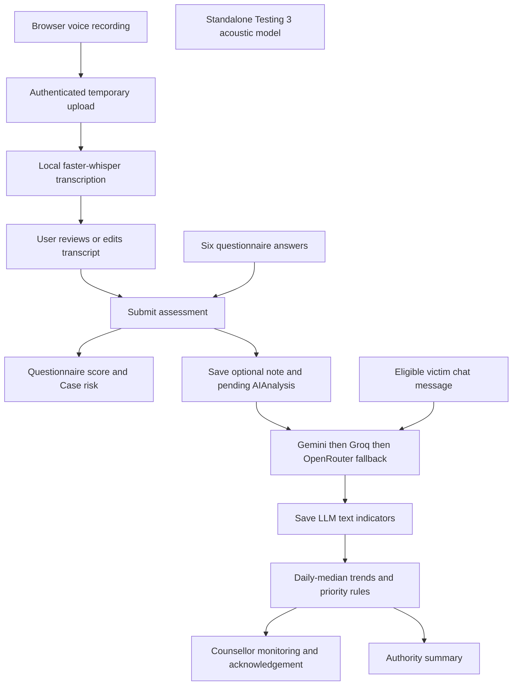
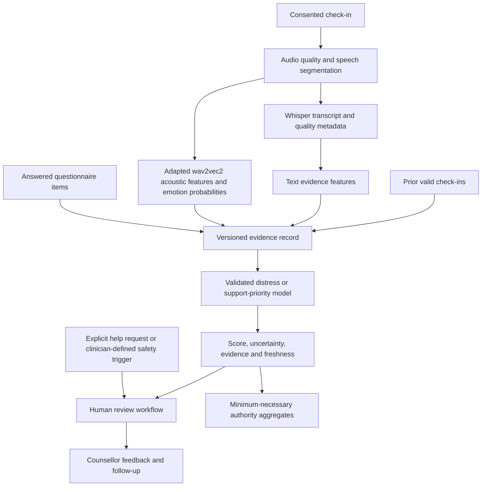

# Sahas speech and distress platform: architecture and improvement report

Review date: 12 September 2026

## 1. Main conclusion

The project contains a functioning application prototype and reproducible speech-emotion experiments, but it does not yet contain a trained, validated speech-based distress model. Improving the existing wav2vec2 model toward 60–70% emotion accuracy is a reasonable experimental objective; there is no evidence yet that this target will be met on unfamiliar speakers or real platform recordings. Even if achieved on RAVDESS, that result would not establish 60–70% accuracy for mental-health distress, depression, or immediate danger.

The highest-priority work is to connect the product's separate evidence streams correctly, establish a speaker-independent evaluation protocol, verify the SpeechBrain implementation against the published reference, and then adapt the existing encoder to the target data. Changing models repeatedly or increasing displayed confidence will not solve these problems.

This review focuses on `testing3_ser.py` and the project's own application. The separate `Speech-Emotion-Recognition` microphone repository is not used as evidence of your platform's accuracy.

## 2. Review scope and verified status

I inventoried and scanned 321 first-party source, configuration, documentation, and result files, representing 176 unique file contents across the copied project versions. The detailed manual review followed the model evaluation, audio handling, frontend recording, assessments, text scoring, persistence, monitoring, authentication, and test paths. All inventoried Python files parsed without syntax errors. See [source_inventory.json](source_inventory.json) for file hashes, line counts, and Python definitions.

This is not a claim of a line-by-line security audit of all 46,246 inventoried lines. Third-party dependencies, generated build output, model-weight internals, secrets, and private database contents were not exhaustively reviewed. Model provenance was checked against publisher documentation. No new training, cloud scoring, or full neural-inference run was performed for this review.

| Check | Result and scope |
|---|---|
| Testing 2 CSV metrics recalculated | 44.50% accuracy; macro F1 0.367523 |
| Testing 3 CSV metrics recalculated | 30.50% accuracy; macro F1 0.198805 |
| Testing 2/3 recording order | Identical 200 filenames |
| Testing 3 reproducibility evidence | Current script SHA-256 matches saved run metadata; all 200 current WAV hashes match its manifest |
| Latest backend tests | 63 passed; isolated SQLite fixtures and mocked model/provider calls |
| Latest frontend | `npm run build` passed; approximately 748 kB main JS bundle, with a size advisory |
| Questionnaire-to-priority integration | Reproduced a Critical questionnaire becoming UNASSESSED in AI monitoring |
| Browser microphone / real Whisper / live provider / deployment | Not end-to-end tested in this review |

Evidence: [verified_metrics.json](verified_metrics.json), [backend_tests.txt](backend_tests.txt), [questionnaire_priority_reproduction.json](questionnaire_priority_reproduction.json).

The earlier full audio audit decoded all 1,440 dataset recordings. It found 24 actors, 60 clips per actor, 88.82 minutes, one byte-identical duplicate pair, five stereo files with identical channels, and no missing expected filenames. The one near-full-scale sample is not evidence of confirmed clipping. See [actor audio report](../actor_audio_analysis/REPORT.md).

## 3. Which project version does what?

| Location | Current role | Assessment |
|---|---|---|
| `testing3_ser.py` | Standalone inference and evaluation of SpeechBrain or SUPERB | Main speech-emotion experiment; no training loop |
| `evaluate_ravdess_testing2.py` | Earlier SUPERB evaluation | Stronger saved baseline, although older evaluation has weaker failure/reproducibility controls |
| `testing3_output/` | Completed SpeechBrain run | Valid saved experimental result, but poor accuracy |
| `testing3_superb/` | Attempted SUPERB rerun | Incomplete; failed while serializing metadata; no completed prediction CSV |
| `testing4_ser.py` | One `MODEL_ID` assignment | Not an implemented evaluator, trainer, or achieved result |
| `sih_backend_latest/` + `sih_frontend_latest/` | Most complete local application | Recommended starting point for consolidation; tests/build passed |
| `sih_backend/` | Earlier backend | No current voice, AI history, or monitoring modules |
| `sih_backend_newai/` | Intermediate copy | Broken voice-service import and unregistered voice route |
| Other frontend copies | Divergent UI snapshots | Do not assume they match the latest backend contracts |
| `Speech-Emotion-Recognition/` | Separate microphone experiment | Excluded from primary performance conclusions |

`START_HERE.md` and older implementation documents refer to `sih_backend` and `sih_frontend`, while the most complete implementation is under `_latest`. Following those paths can launch an earlier product. Determine the actually deployed version separately; local folder names do not prove what is running on a server.

In `sih_backend_newai/app/voice_service.py`, `from .voice_service import transcribe_audio` imports from the same module, but that function is not defined there. The file contains route code instead of a transcription service. `app/main.py` imports `voice_router` but never registers it. Its upload contract is multipart, whereas the latest frontend sends raw audio bytes. Consolidation should select a compatible frontend/backend pair instead of copying individual files without checking their contracts.

## 4. Three tasks that must be measured separately

| Task | Question answered | Suitable evaluation |
|---|---|---|
| Automatic speech recognition (ASR) | What words were spoken? | Word/character error rate, including negation and important phrase errors |
| Speech emotion recognition (SER) | Which annotated emotion best matches this utterance? | Accuracy, balanced accuracy, macro F1, per-class recall |
| Distress / support prioritization | What level of support does the person's evidence warrant under a defined rubric? | Agreement with independently collected labels, calibration, sensitivity, precision, false-alert burden; MAE for a continuous score |

Your `testing3_ser.py` measures SER, not transcription or distress. Its labels are neutral, happy, sad, and angry. RAVDESS filenames identify the intended acted emotion, not a person's clinical condition. The dataset consists of two repeated sentences and eight emotion categories; your experiment uses four of them. [RAVDESS documentation](https://zenodo.org/records/1188976)

Retain sadness in the four-class benchmark. Restricting outputs to angry/neutral/happy would make every truly sad example impossible to classify correctly. A system could still reach a superficially attractive aggregate score while failing the category most relevant to part of your use case.

## 5. Current architecture

### 5.1 The tested SpeechBrain model

The wav2vec2 base family uses convolutional waveform feature extraction followed by a Transformer context encoder. In the cached SpeechBrain configuration, the representation size is 768, pooling computes the mean without standard deviation, and the output classifier is a bias-free linear layer with four outputs. The saved runtime reports 94,374,784 parameters, waveform normalization enabled, and output normalization enabled. The encoder is frozen for this inference configuration. That does not mean its published checkpoint was never fine-tuned.

The label order is `0=neutral, 1=angry, 2=happy, 3=sad`. The code obtains it from the checkpoint's label encoder. It does not guess the order or provide the ground-truth filename to the prediction function. The published SpeechBrain model was fine-tuned on IEMOCAP. Its advertised IEMOCAP scores are not expected RAVDESS scores. Use the actual YAML and forward method for architecture details: the model card contains unrelated speaker-verification wording. [Published configuration](https://huggingface.co/speechbrain/emotion-recognition-wav2vec2-IEMOCAP/raw/main/hyperparams.yaml), [reference inference code](https://huggingface.co/speechbrain/emotion-recognition-wav2vec2-IEMOCAP/raw/main/custom_interface.py), [model provenance](https://huggingface.co/speechbrain/emotion-recognition-wav2vec2-IEMOCAP)

`--preprocess none` means no optional trim/peak-gain operation. It does not disable resampling, mono conversion, or the model's built-in normalization.

The SUPERB branch uses a Hugging Face wav2vec2 sequence-classification checkpoint and its own feature extractor. Its class index order differs from SpeechBrain: neutral, happy, angry, sad. Its configuration includes a 256-dimensional classifier projection. Use each checkpoint's own preprocessing and label map. Its publisher also describes IEMOCAP evaluation, not a guarantee for your dataset. [SUPERB model](https://huggingface.co/superb/wav2vec2-base-superb-er), [configuration](https://huggingface.co/superb/wav2vec2-base-superb-er/raw/main/config.json)

### 5.2 The actual application flow

The standalone acoustic model has no connection to this production-demo flow. Voice upload currently returns only transcript/language information, and the temporary audio is removed afterward. There is no persisted acoustic-analysis record or trained fusion model.

The three score definitions are:

1. **Questionnaire score:** `round(100 * sum(six answers) / 24)`. Thresholds are 25/50/75, with a separate Critical override when `self_harm_thoughts >= 3`. This is a custom engineering formula, not a validated instrument merely because it resembles one.
2. **Text distress indicator:** an LLM generates an integer 0–100. Schema checks enforce matching low/medium/high/critical bands and `requires_attention`. Valid JSON establishes format consistency, not prediction validity.
3. **Priority score:** starts with half the latest LLM score, adds 0/8/18/30 for its risk band, 12 for attention, 10 or 25 for a worsening trend, and 8 for repeated high days, then caps at 100. Categories are NORMAL/MEDIUM/HIGH/URGENT at 30/55/80.

Risk band and attention are derived from the same text score, so their additional priority points do not represent independent corroborating evidence. Trend uses up to seven daily medians from the last 14 days and needs three distinct days. These are useful explicit demo rules, but their clinical relevance has not been measured.

## 6. What the model results actually show

Both saved experiments use the same 200 recordings, with 50 examples per class and all 24 actors represented.

| Metric | Testing 2: SUPERB | Testing 3: SpeechBrain |
|---|---:|---:|
| Correct / total | 89 / 200 | 61 / 200 |
| Accuracy | 44.50% | 30.50% |
| Balanced accuracy | 44.50% | 30.50% |
| Macro F1 | 0.3675 | 0.1988 |
| Neutral recall | 64% | 10% |
| Happy recall | 16% | 12% |
| Sad recall | 4% | 0% |
| Angry recall | 94% | 100% |
| Mean reported confidence | 76.25% | 99.04% |

Testing 3 confusion matrix:

| Actual / predicted | Neutral | Happy | Sad | Angry |
|---|---:|---:|---:|---:|
| Neutral | 5 | 0 | 0 | 45 |
| Happy | 0 | 6 | 0 | 44 |
| Sad | 7 | 8 | 0 | 35 |
| Angry | 0 | 0 | 0 | 50 |

The new model regressed by 14 percentage points. It predicts anger 174 times; only 50 of those predictions are correct, giving anger precision of 28.74%. Its 100% anger recall therefore does not make it a reliable anger detector.

A constant prediction on this balanced set scores 25%. Testing 3 improves on that by only 5.5 percentage points. It is dominated by a near-single-class output pattern. Incorrect predictions average about 99.02% confidence, so confidence is currently a poor basis for deciding whether to trust a result.

### Confirmed causes versus hypotheses

| Finding | Evidence level | What it means |
|---|---|---|
| IEMOCAP-trained checkpoint evaluated on RAVDESS | Confirmed | A cross-corpus generalization test, not an in-domain benchmark |
| No local supervised adaptation in the evaluated scripts | Confirmed | Rerunning the tests does not train the model |
| Class collapse and overconfidence | Confirmed from CSV | Requires investigation before integration |
| Wrong class map or double softmax | Not supported by code inspection | Current code decodes checkpoint labels and validates probabilities |
| Corrupt or missing WAVs caused failure | Not supported by audit | Selected files decode and match saved hashes |
| Incomplete checkpoint recovery, normalization/version behavior | Unresolved | Must be checked numerically against reference inference |
| Silence, recording gain, speaking style, actor differences | Plausible contributors | Need controlled ablations; not proven explanations for the entire failure |

The local SpeechBrain forward computation follows the publisher's single-utterance path at source level. That is encouraging, but it does not prove runtime parity or correct weight recovery. Do not declare a specific loading bug fixed without measuring it. Cross-domain and cross-language SER generalization is an established difficulty. [SER Evals research](https://www.isca-archive.org/interspeech_2024/osman24_interspeech.html)

## 7. Important ongoing product problems

| Priority | Problem | Evidence and required action |
|---|---|---|
| P0 | Questionnaire danger indicators can miss the monitoring queue | Synthetic request with self-harm answer 3 and no note saved score 12 / Critical, but monitoring returned UNASSESSED, no alerts, no review. Make human-review triggers independent of successful text AI. |
| P0 | “Unsafe” mood selection is not submitted | `selectedMood` is used only for local state and styling. Persist and route it under a clinician-approved support workflow, or remove the misleading control. |
| P0 | Unanswered questionnaire fields default to zero | User can submit voice/text while all six answers remain zero. Use an explicit unanswered state; do not equate missing answers with absence of symptoms. |
| P1 | Speech model is disconnected from distress scoring | Add a versioned acoustic-analysis service and observation schema before presenting a multimodal score. |
| P1 | No validated distress target | Define the outcome and independently collect labels; a prompt-generated number is not ground truth. |
| P1 | Multiple divergent app copies | Choose one canonical app pair, archive other versions through version control, and fix setup paths. |
| P1 | No training and calibration pipeline | Add grouped splits, training, model selection, full logits, calibration, and final evaluation. |
| P1 | Model/provider provenance is incomplete in application history | AIAnalysis stores provider name, but not exact model, prompt, preprocessing, or calibration version. Add these before interpreting score trends across model changes. |
| P1 | Acknowledgement is not labelled feedback | AnalysisReview records who reviewed a result and when, not an independent assessment or correction. Add a separate rubric-based feedback record. |
| P1 | Authority access exceeds aggregate-only views | Summary is aggregate-only, but authority can access per-case monitoring/history and AI reasoning. Align access with the intended minimum-necessary role; raw chat is separately restricted. |
| P2 | Long-audio handling is incomplete | Upload checks bytes, but has no decoded-duration budget; browser recording has no hard stop. Bound duration, memory, queueing, and inference time. |
| P2 | Transcript truncation is silent | Endpoint cuts text at 4,000 characters. Indicate truncation or require shorter recordings; do not silently discard potentially important ending content. |
| P2 | Short-message filter can omit relevant content | The generic length rule excludes messages shorter than four characters, including “SOS”. Safety/support intent must not depend solely on this filter or an LLM. |
| P2 | Inference runs inside request processing | Whisper is offloaded to a thread; text analysis waits after source commit. Add bounded workers, job status, retries and crash recovery as usage grows. |

P0 means fix before a real-user pilot, not that the model has established clinical danger in the synthetic example.

The frontend requests noise suppression, echo cancellation, and automatic gain control. Those settings can help transcription while changing acoustic cues relative to clean WAV files. Record capture settings and validate the actual browser pipeline. Do not blindly disable processing; compare it on realistic recordings.

The current design has useful foundations worth preserving: authenticated uploads, local transcription, an editable transcript, source persistence before cloud calls, explicit pending/failed states, scoped counsellor access, and human review. The missing work is scientific validation and integration, not a complete rewrite of every component.

## 8. Step-by-step route toward 60–70% SER accuracy

### Step 1: Specify the claim before optimizing

Use a concrete first milestone: “Four-class speech-emotion classification on unseen speakers, with 60–70% accuracy and balanced accuracy, while reporting macro F1 and every class's recall.” Aim toward 70%, but treat it as a hypothesis to test. Add a development gate such as no class recall below 50%; this is an engineering criterion, not a clinical safety threshold.

Measure ASR separately. Define distress validation separately. Do not change the label set, remove sad examples, or exclude difficult actors after seeing results in order to reach a percentage.

### Step 2: Stabilize the implementation and environment

Preserve the current results. Use one experiment environment and an exact lockfile. Save Python/package versions, model revision hashes, preprocessing settings, and dataset hashes for every run. The current run differs from the older versions suggested in the script header; version drift merits a controlled comparison, not an automatic conclusion that the runtime is incompatible. In particular, current TorchAudio 2.11 supports newer PyTorch versions through its stable ABI, so unequal version numbers alone are not proof of an error. [TorchAudio compatibility](https://docs.pytorch.org/audio/main/installation.html)

The saved SUPERB rerun failed on a JSON set-serialization error. The current script has `json_safe`, and its hash matches the completed SpeechBrain run, but no successful SUPERB rerun artifact exists. Complete that comparison in a new output directory; do not interpret the failed folder as a poor-accuracy run.

### Step 3: Establish reference inference parity

Before training, use a small, fixed diagnostic set with examples of all four classes and a publisher reference example where available. Compare the local classifier against the published `CustomEncoderWav2vec2Classifier` using the identical decoded waveform and checkpoint revision.

Record input sample rate, sample count, RMS, normalization settings, pooled embedding statistics, logits, full probabilities, and decoded labels. Check all checkpoint loading messages, missing/unexpected keys, model eval mode, and recovered encoder/head tensors. Require the two paths to agree numerically within a documented tolerance appropriate to the hardware. Use one utterance per batch first, then verify padding-aware pooling before batching.

If predictions disagree, fix the inference discrepancy before investigating the dataset. If both paths agree and both collapse, move to domain adaptation; repeatedly changing wrappers will not train a better decision boundary.

### Step 4: Create a proper dataset manifest and grouped split

Your folder has 672 clips in the four benchmark classes: 96 neutral and 192 each happy, sad, and angry. Each actor contributes 28 target clips. The full eight-class corpus is a separate task.

Manifest fields should include dataset, recording ID, file hash, duplicate group, speaker ID, session ID if available, emotion, intensity, sample rate, duration, and split. Keep labels and filenames outside model inputs.

For internal development, use six outer folds with four actors per fold. Tune training settings only on inner actor-grouped folds. Keep every recording and augmentation from a speaker on one side of a split. If resources require a simpler 16-actor training / 4-actor validation / 4-actor test layout, predeclare it and explicitly call it a retrospective internal benchmark: all 24 actors already appeared in inspected results. A genuinely fresh final claim requires additional unseen speakers or an independently reserved corpus.

Use grouped splitting rather than random clip splitting. The natural four-class dataset is imbalanced, so accuracy and balanced accuracy will no longer necessarily be equal. Fit feature scalers, feature selection, calibration, and any learned preprocessing using the permitted training/development partitions only. [Grouped cross-validation documentation](https://scikit-learn.org/stable/modules/cross_validation.html)

### Step 5: Train a head on the existing encoder first

Keep your SpeechBrain wav2vec2 encoder initially frozen and extract its 768-dimensional mean-pooled embeddings once. Train a regularized four-class linear/softmax head on the training actors. Compare to the original head and a majority-class baseline. This directly adapts the classifier to the available task while retaining the existing model family and is cheaper than full encoder fine-tuning.

Use class weighting computed on the training partition, or a balanced sampler; do not apply both automatically. Select regularization using actor-grouped validation. Preserve the four-class label dictionary with the model. This is a new trained model version derived from your existing checkpoint, not a claim that the unchanged pretrained checkpoint has improved.

As a diagnostic, ensure a tiny training subset can be overfit. That checks whether gradients, labels, and checkpoint saving are connected; its training accuracy must never be reported as generalization accuracy.

### Step 6: Fine-tune the upper encoder layers if needed

If the trained head improves but plateaus below the target, unfreeze the last two to four Transformer blocks and train conservatively. Example starting search settings—not tested best settings—are encoder learning rates around 1e-5 to 3e-5, a head learning rate around 1e-4 to 1e-3, AdamW with weight decay, gradient clipping, and early stopping on validation macro F1.

Start with the convolutional feature extractor frozen. Use small batches with gradient accumulation if memory requires it. Run at least three seeds for the selected configuration and report variation. Keep the original mean-pooling head as the first architecture; compare more complex pooling only after a reliable baseline exists.

The inference configuration uses `freeze: True`, and prediction runs under `torch.inference_mode()`. A training implementation must explicitly enable gradients, set intended modules to train mode, build the optimizer, compute loss, update weights, and save the selected checkpoint. The existing test script does none of these. The publisher provides a wav2vec2 training recipe that can guide structure, but its data preparation must be adapted to your manifests. [SpeechBrain training recipe directory](https://github.com/speechbrain/speechbrain/tree/develop/recipes/IEMOCAP/emotion_recognition)

### Step 7: Run small, controlled robustness experiments

Compare one change at a time: original preprocessing, boundary-only trimming, and mild training-time noise/reverberation/codec augmentation that resembles browser recordings. Preserve internal pauses and record how much audio is removed. Avoid aggressive pitch shifting or amplitude normalization without measuring the effect on emotion cues.

Peak gain may add little where a checkpoint already normalizes waveform variance. Trimming can affect pooled representations; it is not guaranteed to help. Do not copy the separate microphone script's absolute silence threshold into this dataset: many RAVDESS recordings are quiet. Include a speech/non-speech quality gate and an unavailable result instead of assigning silence to neutral.

If more data is added, document label alignment and speakers, inspect train/test overlap and checkpoint provenance, and retain an external-corpus evaluation. A public model named “RAVDESS optimized” may have trained on your test files; its score on those files would not establish independence.

### Step 8: Save full outputs, then calibrate

Extend evaluation output beyond the winning label and confidence. Save all four logits/probabilities, speaker, intensity, quality flags, and inference duration. Top-one confidence alone cannot reconstruct multiclass log loss, full Brier score, or a calibration model.

Fit temperature scaling on a separate permitted calibration partition or grouped out-of-fold predictions. Report reliability plots, log loss, and a calibration summary. A positive scalar temperature preserves argmax, so it can improve confidence interpretation but cannot increase top-one accuracy by itself. Do not promise a 30.5% to 70% accuracy jump from calibration. [Calibration guidance](https://scikit-learn.org/stable/modules/calibration.html), [temperature-scaling research](https://proceedings.mlr.press/v70/guo17a.html)

Set uncertainty/rejection behavior using development data. Report both the accuracy on accepted cases and the fraction accepted. Rejecting most hard cases and reporting only the remaining score is not 70% performance on all recordings.

### Step 9: Evaluate on the deployment conditions

Collect consented recordings from new speakers using the intended phones, browsers, languages, and recording instructions. Include natural rather than only acted speech, quiet and noisy environments, pauses, multiple speakers, and recording failures. Do not infer demographic categories from voices; use consented metadata where subgroup analysis is justified.

Report per-language/device/speaker results and uncertainty. Bootstrap by speaker/session rather than treating all windows as independent. A test of 200 correlated clips from 24 actors is not equivalent to 200 independent people. Report the blind result once the model and thresholds are fixed; if it fails, disclose that and use a new final evaluation after redevelopment.

## 9. Build the distress tool as a separate supervised problem

### Define the output with counsellors

Decide whether you are estimating current self-reported distress, a counsellor's support-priority category, or a symptom score over a defined period. These labels are not interchangeable. Agree on the unit (utterance, check-in, person-day), time horizon, annotation rubric, and intended action before collecting data.

Use a clinician-selected validated instrument appropriate to the population and language where suitable, plus an independent counsellor review rubric. Do not rename the existing six-question sum as PHQ-9 or another established scale. Have reviewers assess a subset independently and measure agreement; adjudicate disagreements without showing model predictions first where practical.

DAIC-WOZ is a potentially useful research resource because it contains clinical interview audio, transcripts, and questionnaire information. It requires approved access and restricts distribution to academics/non-profit researchers. It is not automatic validation for Indian-language everyday check-ins or real-time emergency triage. [DAIC-WOZ source and access conditions](https://dcapswoz.ict.usc.edu/)

### Proposed target architecture

Start with an interpretable supervised model—regularized logistic/ordinal regression for defined categories, or a regularized regression model for a continuous target—rather than another large network on a small labelled cohort. Use acoustic embeddings or calibrated emotion probabilities, text evidence, answered questionnaire items, quality/missingness flags, and valid historical features. Fit any fusion weights from development data. Train stacking/fusion on out-of-fold base-model predictions where the base models were fitted on the same dataset.

Do not implement a rule such as angry=80, sad=70, happy=0. An emotional style is not a distress label. Direct requests for help should enter a human workflow independently; an apparently happy acoustic prediction must not cancel them. If evidence is insufficient, return unknown/unavailable rather than zero. WHO's health-AI guidance supports designing for human autonomy, accountability, and affected communities. [WHO guidance](https://www.who.int/publications/i/item/9789240029200)

If you publish a 0–100 number, specify what it means. `100 * calibrated_probability` is appropriate only for a clearly defined, validated binary event; otherwise label it as a model-specific index and validate it against the chosen scale. No mathematical rescaling makes an unvalidated score clinically meaningful.

### Required implementation pieces

| Piece to add | Responsibility |
|---|---|
| `ml/manifests/` and split generator | Data provenance, speaker groups, duplicate controls, immutable folds |
| `ml/train_ser.py` | Frozen-head training and controlled encoder adaptation |
| `ml/evaluate_ser.py` | Arbitrary manifest sizes, full predictions, subgroup metrics, calibration and uncertainty |
| Shared `audio_preprocessing.py` | Identical decoding/resampling semantics in evaluation and API |
| Backend acoustic service | Load one approved local model version, quality checks, bounded inference |
| Versioned observation schema | Input source, model/version, language, quality, score, missingness, timestamps, processing status |
| Distress training/evaluation module | Separate labelled target, participant/time-aware evaluation, learned fusion |
| Human review record | Reviewer label, rubric version, disagreement/correction, action, later outcome where consented |
| Model registry | Checkpoint, labels, preprocessing, training manifest, calibration, metrics and rollback identifier |
| Bounded worker queue | Retryable jobs, concurrency limits, expiration, status and failure recovery |

These are proposed additions, not files implemented by this review. Keep the existing source-first persistence and honest failure behavior. An acoustic failure must not prevent a questionnaire or direct support request from being saved.

Deleting temporary raw audio is a useful privacy default. For operational scoring, acoustic features can be computed during the permitted processing window and retained only under the agreed policy. Training-data retention requires explicit consent and a defined retention/deletion process. Acoustic embeddings can still be sensitive. Clarify that local transcription does not mean text scoring stays local: the submitted transcript currently goes to configured cloud providers.

## 10. Prioritized delivery plan and acceptance checks

The following is an order of work, not a guaranteed schedule or accuracy forecast.

| Phase | Deliverable | Acceptance check |
|---|---|---|
| 1. Product correctness | Canonical app pair; fix unsubmitted mood, missing-answer defaults, and questionnaire-to-review path | A flagged synthetic questionnaire and explicit help request reach staff review even when every AI provider fails |
| 2. Inference integrity | Locked environment and reference parity harness | Same waveform/checkpoint gives matching logits; loading and class order documented |
| 3. Research foundation | Speaker-grouped manifests and general evaluator | Zero group/hash overlap; no silent skipped cases; all class metrics saved |
| 4. Adapt existing model | Frozen-head baseline, then upper-layer fine-tuning if warranted | Grouped validation improves over original model; results across seeds disclosed |
| 5. SER milestone | Locked candidate and external test | Report 60–70% only if measured; include balanced accuracy, sadness recall, calibration and coverage |
| 6. Distress definition/data | Counsellor-approved rubric and consented labelled cohort | Target and annotation agreement documented; no model-generated labels treated as truth |
| 7. Fusion prototype | Versioned acoustic/text/questionnaire evidence and supervised scoring | Beats appropriate simple baselines on unseen participants; missing data produces honest states |
| 8. Shadow pilot | Predictions visible for evaluation alongside usual care | Counsellors measure missed concerns, false alerts, usefulness and workload; no autonomous authority action |

For the first coding sprint, prioritize phases 1–3. Full end-to-end fine-tuning can follow once you trust the inference and evaluation machinery. On limited hardware, cached embeddings plus a regularized head are the practical first experiment. Measure memory and latency on your machine before choosing a training device or deployment arrangement.

## 11. What has gone wrong, stated directly

You have treated success on an emotion dataset as if it could validate a distress score; expected a pretrained cross-corpus model to reach a target without local adaptation; used aggregate accuracy despite severe sadness failure; and built several score paths without a unified evidence and review contract. The copied project folders and stale setup documentation make these gaps harder to see. The UI also records some choices only visually, and defaults unanswered questions to no symptoms.

However, `testing3_ser.py` already has useful scientific safeguards: fixed recordings, label validation, waveform-only prediction, hashes, no silently skipped cases, correct probability checks, protected output folders, and per-class reporting. Preserve those. The main next step is a real training/validation pipeline and a separately validated distress target—not another script that loads a new checkpoint and hopes the percentage rises.

## 12. Limitations of this review

The saved SER metrics and the synthetic integration failure are verified. The root cause of SpeechBrain's extreme output bias remains unresolved pending runtime reference parity and checkpoint checks. The review did not fine-tune a model, achieve a new accuracy score, conduct a listening-based emotion assessment, validate mental-health outcomes, or inspect a live deployment. The 63 passing backend tests and frontend build establish useful software evidence; they do not validate clinical decisions or real microphone performance.
